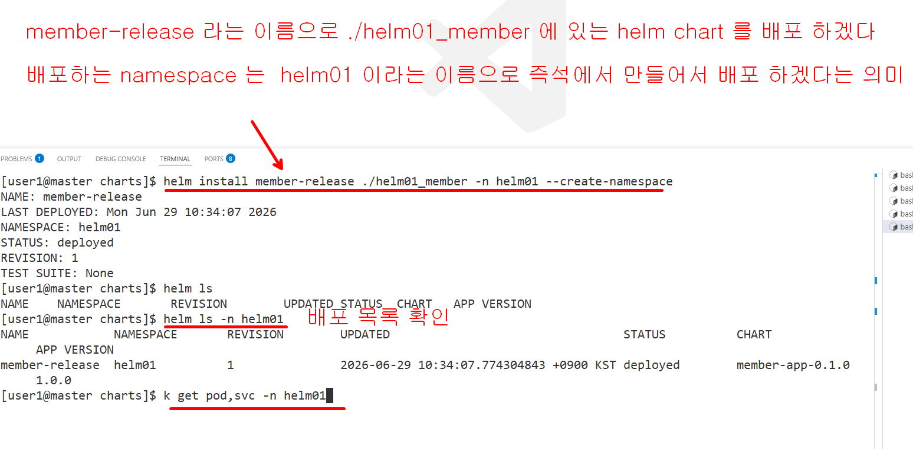
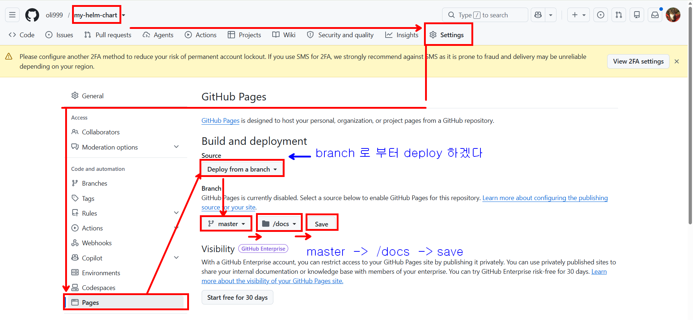
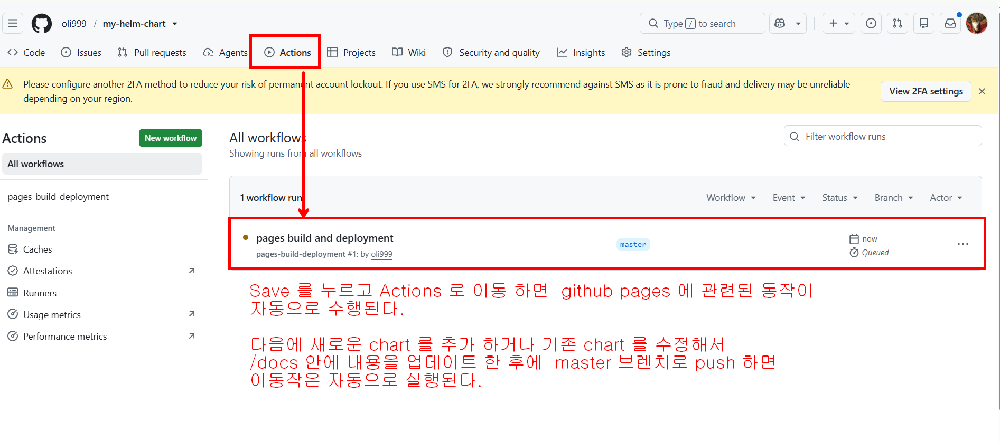

## helm chart에 관한 기본정보
```bash
templates: helm이 해석할 예정인 미완성의 yaml 파일을 작성하는 폴더(go lang 해석)
Chart.yaml: helm chart의 기본 정보 명시하는 파일
values.yaml: chart에 동적으로 전달할 정보를 명시하는 파일(변수)
```


## 나만의 helm chart를 만들고 github pages 배포해보자


### templates yaml 파일 작성법


### 작성한 chart 가 잘 실행되는지 확인해 보자



### 작성한 helm chart 소스 코드를 일단 github 에 push 한다
```bash
git init
git add .
git commit -m "helm01_member 추가함"
git remote add origin git@github.com:yimjongwon/my-helm-chart.git
git push -u origin master
```


### docs 폴더를 구성한다
```bash

# docs 폴더 준비하기
mkdir -p docs
# chart를 압축해서 docs/ 폴더 안에 저장
helm package charts/helm01_member -d docs/
# index.yaml 파일을 docs/ 폴더에 생성하기
helm repo index docs/ --url https://<나의github아이디>.github.io/저장소이름/
helm repo index docs/ --url https://yimjongwon.github.io/my-helm-chart/


git add ./docs
git commit -m "release: member-app chart v1.0.0 package"
git push origin master
```

### push 후에 github 에  pages 에 관련된 설정을 1번만 해주면 다음부터는 자동으로 pages 에 반영된다.





### 우리가 만든 helm chart 저장소를 사용해보기

```bash
helm repo add my-repo https://yimjongwon.github.io/my-helm-chart/
helm repo ls
helm repo update
helm search repo my-repo

# github pages에서 내려받은 helm chart를 배포하기
# 이미 존재하는 namespace가 있으면 삭제후
kubectl delete ns helm01
# 배포하기
helm install member-release my-repo/member-app -n helm01 --create-namespace
# 확인하기
kubectl get pod,svc -n helm01

# helm01 네임스페이스에 배포된 목록확인
helm ls -n helm01

# 배포취소
helm uninstall member-release -n helm01
kubectl delete ns 


### 버전 v1.0.1
helm package charts/helm01_member -d docs/
helm repo index docs/ --url https://yimjongwon.github.io/my-helm-chart/
git add ./docs
git commit -m "release: member-app chart v1.0.1 package"
git push

# push 후 1~2분 뒤 업데이트
helm repo update
# 저장소에 어떤 chart 있는지 검색
helm search repo my-repo
# version이 올라간걸 확인가능
NAME                    CHART VERSION   APP VERSION     DESCRIPTION               
my-repo/member-app      0.1.1           1.0.1           fastapi member application

```